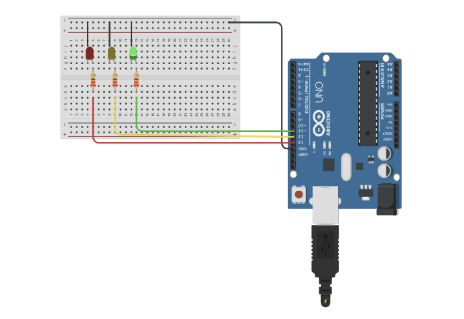
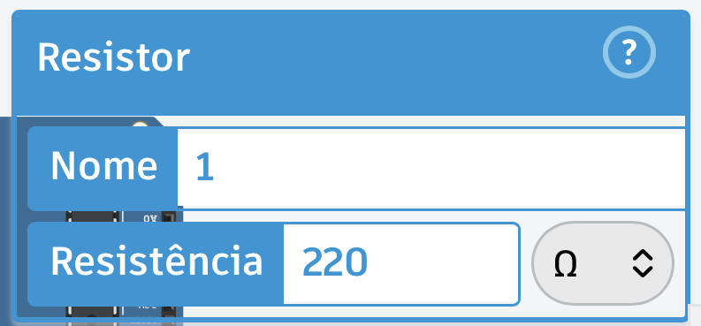
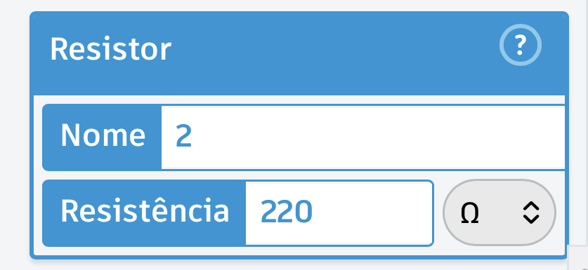
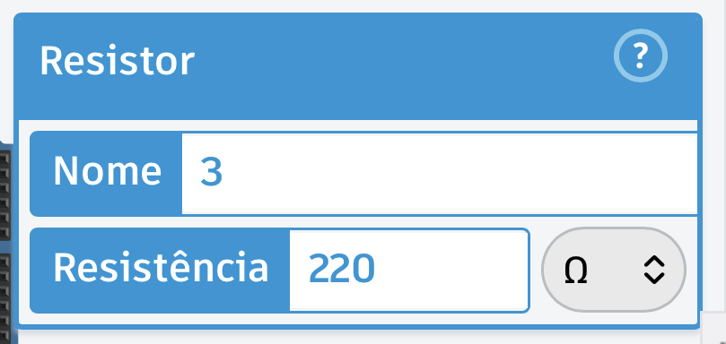

# 🚦 Semáforo com Alertas usando Arduino

## 📋 Sobre o Projeto
Este projeto simula o funcionamento de um semáforo de trânsito utilizando a placa Arduino Uno R3. A lógica desenvolvida em C++ vai além do ciclo de cores tradicional, incorporando laços de repetição (`for`) para criar estados de alerta com os LEDs piscando.

**Ciclo de Funcionamento:**
1. 🟢 **Sinal Verde:** Aceso por 4 segundos.
2. 🟡 **Sinal Amarelo:** Pisca 4 vezes como alerta de transição.
3. 🔴 **Sinal Vermelho:** Aceso por 4 segundos.

---

## 🎥 Demonstração do Projeto
Abaixo está o vídeo demonstrando o funcionamento do ciclo completo no simulador:

[🎬 Clique aqui para assistir ao vídeo da simulação](imagens/VideoSimulacao.mov)

---

## 🔌 Esquema Elétrico e Montagem
A montagem foi feita em protoboard, organizando as saídas digitais e o aterramento (GND). 

---

## 🛠️ Lista de Componentes
Para replicar este circuito físico ou no simulador, os materiais estão documentados no arquivo [`ListaItens.csv`](imagens/ListaItens.csv). Resumo dos itens:

* 1x Placa Arduino Uno R3
* 1x Protoboard
* 1x LED Verde (Ligado ao Pino 11)
* 1x LED Amarelo (Ligado ao Pino 12)
* 1x LED Vermelho (Ligado ao Pino 13)
* 3x Resistores de **220 ohms** (Essenciais para não queimar os LEDs). Confira as configurações:
  * 
  * 
  * 
* Cabos Jumper

---

## 💻 Código-Fonte
O código completo com a declaração das variáveis, configuração das portas de saída (`setup`) e a lógica de execução (`loop`) está disponível no arquivo principal deste repositório: 

📄 **[`CodigoArduinoSemaforoPiscante.ino`](CodigoArduinoSemaforoPiscante.ino)**

---

## 👨‍💻 Autor
**Fellipe Gabriel Santos Dultra**
